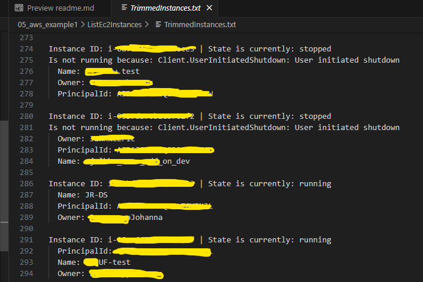

# <u>ListEc2Instances</u>

This is the codebase for a small Golang Project built by Jon Baillie. 
Feel free to fork this or copy and improve - this is the point where for my own personal reasons I call it finished.  

The purpose of the program is to create 2 files of EC2 instances. 

FullInstances.json - This is the unedited payload from AWS, with all Ec2 Instances and all their attributes an information. 
TrimmedInstances.txt - This is a finer formatted list including the instances' ID, if they're running or not, and all tags associated with the instance.  
These Files are then available in the same directory from where you ran the application.

** Potentially sensitive information has been censored.

## <u>Requirements</u>
* To do either the CLI Usage or Build an exe options below you need of course to have Go installed:
[Install Go](https://go.dev/doc/install)
* Credentials block already configured through the AWS CLI. Such credentials blocks typically look like this;
~~~
[default]
aws_access_key_id        = REDACTEDFORSECURITY
aws_secret_access_key = <<123456789ABCDEFGHIJKLMNOPQRSTUVWXYZabcde>>
region                   = eu-central-1
~~~
This credentials file ought to be at C:\\\<Username>\\\.aws\\

## <u>Usage and Building</u>

### <u>CLI Usage</u>
You can run this in a terminal window. 
Clone the repo, navigate to the folder where main.go is found, and run:
~~~
go build main.go
~~~
 

### <u>Build an exe</u>
Or you can build a portable exe:

~~~
go build -o ListEc2Instances.exe main.go
~~~
And then run the .exe wherever you like.
  

### <u>Download</u>
Or the easiest way would be to download and unzip the latest release version, on the right hand side.

